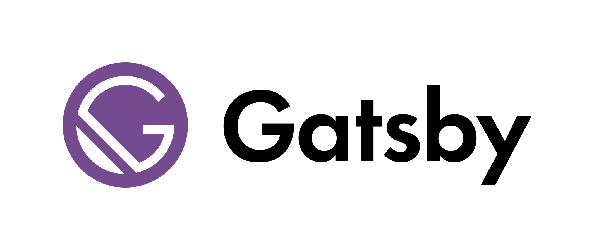

> Gatsby is the fast and flexible framework that makes building websites with any CMS, API, or database fun again.
> Build and deploy headless websites that drive more traffic, convert better, and earn more revenue!

| Number | Things we're going to cover                   | Section |
| :----- | :-------------------------------------------- | ------: |
| 1      | Static page generation with gatsby            |       2 |
| 2      | Using gatsby-image for lazy-loading of images |       4 |
| 3      | Other useful gatsby plugins                   |       6 |

### Why I like Gatsby

- It's React
- Extendable by their plugin system
- Data fetching made easy from all the popular CMS systems
- Performance out of the box
- Great developer experience

### What will you learn about gatsby from me

In this course you will learn how to initalize a gatsby project, fetch these mdx posts and create separate pages for them.
You will also learn how to use data from this posts (in our example their tags),
and use this data to create pages that would list all the posts containing that tag.
You will also learn how to use the gatsby-image plugin and why is it useful.

#### And we will briefly cover these plugins:

- gatsby-plugin-google-fonts
- gatsby-plugin-react-helmet
- gatsby-source-filesystem
- gatsby-plugin-feed
